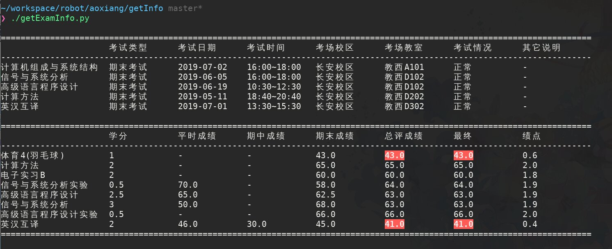

### 这里是一些爬取信息的脚本

- 功能
  - `getExamInfo.py`
    - 此脚本会爬取教务系统中的考试安排和考试成绩
    - 会剔除过时的考试, 没有安排时会剔除考试安排的输出
    - 如果没有出成绩则剔除成绩的输出
    - Debug 状态下所有成绩减30分以制造挂科条件, 显示过时的考试安排, 显示成绩输出
    - 效果图
      

### 依赖库
- python
  - requests
  - bs4
  - html5lib

### 版本更新历史
[CHANGELOG.md](CHANGELOG.md)