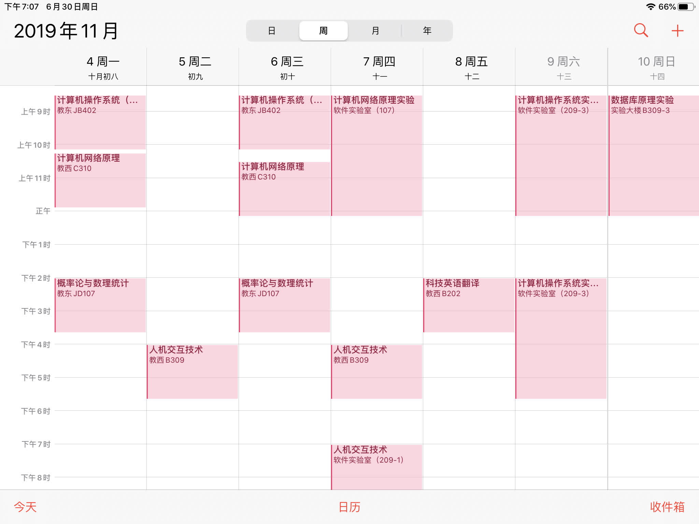

### 总述

- 对于 **西北工业大学** 的学生

  你可以运行 `GetClass.py` 脚本以从教务系统爬去你的课程信息

- 对于其他学校的学生

  你需要修改`settings/ClassInfo.json`

- 对于所有人

  当你获取到所有的信息后运行`classTable.py`生成一个名为`res.ics`的日历文件，导入你的日历应用

效果图



### 依赖库

- python
  - requests
  - lxml
  - xlrd

### 配置文件的格式

- settings/classInfo.json

  ```json
  [
      {
          "name": "这节课的名字",
          "week": {
              "start": "这节课开课周",
              "end": "这节课结课周[单|双]"
          },
          "day": "这节课周几上，例如周日是7，周一是1",
          "time": {
              "start": "start time, example: 0830"
              "end": "end time, example: 1010"
          },
          "room": "教室",
          "teacher": "老师名字"
      }
  ]
  ```

